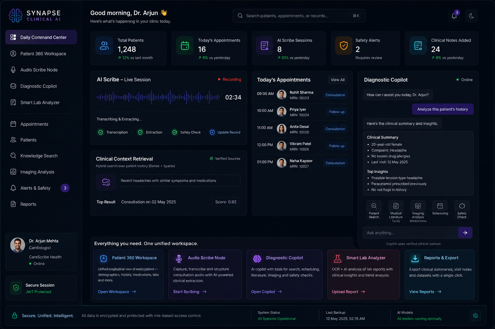
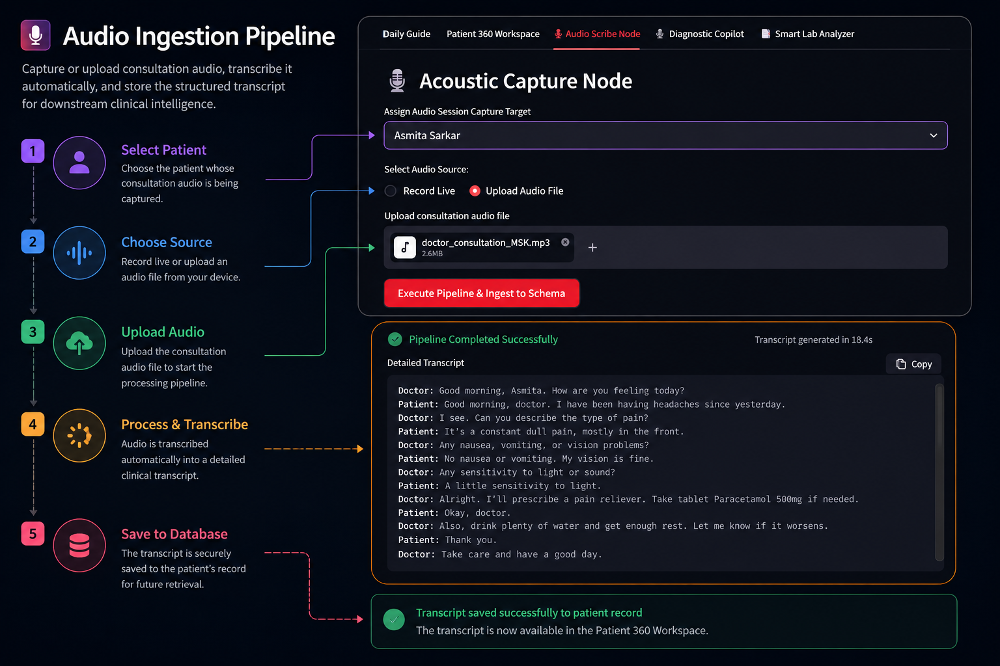
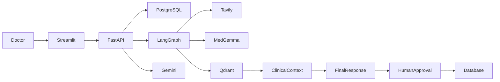

<!-- ====================================================================== -->
<!--                              HERO SECTION                              -->
<!-- ====================================================================== -->

<div align="center">


# ISHAN SARKAR

### Building Production AI Systems


<br>

> **Designing reliable AI systems where deterministic software engineering meets practical machine learning.**

</div>

<br>

<table align="center">
<tr>

<td width="58%" valign="top">

## About

Building complete AI systems from **backend infrastructure to intelligent applications**.

My work focuses on **production-grade AI engineering**, combining scalable backend development with modern LLM architectures including **Agentic AI, Hybrid RAG, Multi-Agent Systems, and Healthcare AI**.

I enjoy solving engineering problems where deterministic software meets probabilistic models—designing systems that are reliable, observable, and safe for real-world deployment.

<br>

### Core Focus

- Production AI Systems
- Backend Engineering
- Agentic AI
- Retrieval-Augmented Generation
- Healthcare AI
- AI Infrastructure

</td>

<td width="42%" valign="top">

## Currently Building

```text
🏥 Synapse Clinical AI

Production-ready
clinical AI platform
```

---

```text
🤖 Agentic AI

LangGraph
Pydantic AI
Multi-Agent Systems
```

---

```text
🧠 AI Infrastructure

Hybrid RAG

Qdrant

FastAPI

PostgreSQL
```

---

```text
🔬 Research

Healthcare AI

Model Context Protocol

LLM Engineering
```

</td>

</tr>
</table>

<br>

<div align="center">

<a href="YOUR_RESUME_LINK">

</a>

<a href="https://linkedin.com/in/ishan-sarkarps1">

</a>

<a href="mailto:ishan.sarkar62@gmail.com">

</a>

<a href="https://github.com/Ishan-AI-coder">

</a>

</div>

<br>

<div align="center">


</div>

<br>

<div align="center">


</div>

---
<!-- ====================================================================== -->
<!--                               ABOUT ME                                 -->
<!-- ====================================================================== -->

## About Me

I build **production-grade AI systems** that combine reliable software engineering with practical machine learning. My interests lie at the intersection of backend engineering, large language models, and intelligent systems—where scalable infrastructure meets probabilistic AI.

Rather than treating an LLM as the entire application, I design systems in which the model is only one component of a larger architecture. Authentication, data modeling, retrieval, orchestration, observability, and safety remain deterministic, while language models provide reasoning where they add the most value. This separation makes AI applications easier to understand, test, and maintain in production.

My recent work has focused on **Agentic AI**, **Hybrid Retrieval-Augmented Generation (RAG)**, **multi-agent workflows**, and **healthcare AI**. I enjoy building systems that retrieve trusted context, coordinate specialized tools, and keep humans involved in high-impact decisions through structured approval workflows.

From secure FastAPI services and PostgreSQL-backed applications to LangGraph agents and vector search pipelines, I enjoy solving engineering problems that span the full stack of modern AI applications. I care as much about API design, data integrity, and system reliability as I do about model quality.

Ultimately, I'm interested in building AI software that is **grounded, observable, and dependable**—systems that engineers can reason about, users can trust, and organizations can confidently deploy.

> **Engineering Philosophy**
>
> *Build deterministic software around probabilistic models. The intelligence should come from the AI; the reliability should come from the engineering.*

<!-- ====================================================================== -->
<!--                         ENGINEERING FOCUS                              -->
<!-- ====================================================================== -->

## Engineering at a Glance

<table>
<tr>

<td width="50%" valign="top">

### 🚀 Production AI

Building intelligent systems designed for real-world deployment.

- Healthcare AI Platforms
- Agentic AI Workflows
- Hybrid RAG Pipelines
- FastAPI Backend Services
- Secure API Architectures
- Human-in-the-Loop AI

</td>

<td width="50%" valign="top">

### 🔬 Research Interests

Exploring the next generation of AI systems.

- Multi-Agent Systems
- Model Context Protocol (MCP)
- Agent Memory
- Long-Context Reasoning
- LLM Evaluation
- AI Infrastructure

</td>

</tr>

<tr>

<td width="50%" valign="top">

### 🏗️ Currently Building

Projects I'm actively developing.

- 🏥 Synapse Clinical AI
- ⚙️ AI SDK & MCP Integrations
- 📚 Production RAG Pipelines
- 🤖 AI Automation Workflows

</td>

<td width="50%" valign="top">

### 🎯 Open To

Looking for opportunities to build impactful AI systems.

- AI Engineering Internships
- Backend Engineering
- Applied Machine Learning
- Open Source Collaboration
- Research Opportunities

</td>

</tr>

</table>

---
<!-- ====================================================================== -->
<!--                         FEATURED PROJECTS                              -->
<!-- ====================================================================== -->

# Featured Engineering Projects

---

# 🏥 Synapse Clinical AI

### *Production-Grade Clinical AI Platform for End-to-End Patient Care*

> A full-stack clinical AI platform that combines secure backend engineering, agentic AI, hybrid retrieval, and human-in-the-loop validation to help clinicians manage patient care from a single interface.

<div align="center">

[](https://github.com/Ishan-AI-coder/Synapse-Clinical-AI)

</div>

---

# Why I Built It

Most healthcare AI applications stop at answering questions.

I wanted to build something closer to a production system—one that combines secure backend services, AI-assisted clinical workflows, structured patient records, retrieval over historical consultations, and deterministic safety checks.

The goal wasn't simply to integrate an LLM, but to demonstrate how modern AI systems can coexist with reliable software engineering practices in high-stakes environments.

---

# Platform Walkthrough

## AI Diagnostic Copilot



A LangGraph-powered clinical assistant capable of:

- Patient search
- Appointment scheduling
- Medical literature search
- Medical image analysis
- Context-aware clinical reasoning

All recommendations pass through **human approval** before affecting patient records.

---

## AI Audio Scribe



Consultation recordings are automatically transformed into structured clinical information.

Pipeline:

```
Audio

↓

Gemini Transcription

↓

Structured Extraction

↓

Drug Interaction Checks

↓

Allergy Validation

↓

Patient Database
```

The entire workflow is deterministic after transcription, ensuring extracted information conforms to predefined schemas before storage.

---

## Hybrid Clinical Retrieval


Every AI response is grounded using hybrid retrieval over previous consultations.

The retrieval pipeline combines

- Dense embeddings
- Sparse retrieval
- Cohere reranking

to minimize hallucinations while maintaining relevant clinical context.

---

## Report Analysis


Upload laboratory reports or diagnostic documents to generate:

- Clinical summaries
- Abnormal value detection
- Risk assessment
- Recommended follow-up actions
- Downloadable PDF reports

---

# Architecture



---

# Engineering Highlights

### 🔒 Secure Backend

- JWT Authentication
- OAuth2
- FastAPI
- SQLAlchemy
- PostgreSQL

Designed with a strict separation between application logic and AI reasoning.

---

### 🧠 Agentic Clinical Copilot

Built using LangGraph with specialized tools including

- Patient Search
- Scheduling
- Literature Search
- Medical Imaging
- Hybrid Retrieval

Every action remains observable and auditable.

---

### 🎙️ AI Audio Scribe

Combines

- Gemini transcription
- Structured extraction
- Drug interaction validation
- Allergy detection

before committing changes to patient records.

---

### 📚 Grounded Clinical AI

Hybrid RAG over patient consultation history using

- Dense retrieval
- Sparse retrieval
- Cohere reranking
- Qdrant

ensuring responses remain grounded in verified patient context.

---

# Technology Stack

| Layer | Technology | Purpose |
|---------|------------|----------|
| Backend | FastAPI | REST APIs |
| Authentication | JWT / OAuth2 | Secure Access |
| Database | PostgreSQL | Patient Records |
| ORM | SQLAlchemy | Persistence |
| Agent Framework | LangGraph | Diagnostic Copilot |
| LLM | Gemini | Transcription & Reasoning |
| Vision Model | MedGemma (Ollama) | Medical Imaging |
| Retrieval | Qdrant | Hybrid RAG |
| Search | Tavily | Live Literature Search |
| Frontend | Streamlit | Clinical Dashboard |

---

# Engineering Decisions

Rather than allowing the language model to directly manipulate patient data, every AI-generated output flows through deterministic validation layers before persistence.

Key design principles include:

- Schema-constrained extraction
- Human approval before updates
- Deterministic backend logic
- Retrieval-grounded reasoning
- Explicit safety checks

These boundaries make the system easier to reason about and significantly reduce opportunities for incorrect AI outputs to propagate into patient records.

---

# Lessons Learned

The most valuable engineering decision wasn't selecting the language model—it was defining clear boundaries around it.

Treating AI as a probabilistic component while enforcing reliability through deterministic software produced a system that is significantly easier to audit, maintain, and extend.

---

# Roadmap

- [ ] FHIR Integration
- [ ] MCP Tool Servers
- [ ] Agent Memory
- [ ] Kubernetes Deployment
- [ ] Evaluation Dashboard
- [ ] Multi-Hospital Support

---

# 🤖 Health Nexus

### *Multi-Agent Healthcare Assistant*

> A healthcare assistant that orchestrates six specialized AI agents to provide personalized medical guidance and comprehensive report analysis.

**Highlights**

- Six domain-specific AI agents
- LLM-based intent routing
- Parallel report analysis
- PDF report generation
- Interactive Streamlit interface

**Repository**

https://github.com/Ishan-AI-coder/Health-Nexus

---

# 📄 OmniRAG

### *Multimodal Research Assistant*

> A multimodal retrieval system capable of answering questions across multiple research papers, including figures, charts, and embedded images.

**Highlights**

- Hybrid RAG
- Concurrent image captioning
- LangGraph tool-calling agent
- Safe Python execution
- Perfect RAGAS evaluation scores

**Repository**

https://github.com/Ishan-AI-coder/OmniRAG

---

# 📊 SheetSense

### *AI-Powered Data Analysis Platform*

> A multi-agent analytics platform that enables natural-language exploration of structured datasets without writing code.

**Highlights**

- Four specialized AI agents
- Chart generation
- Context-aware Q&A
- Sandboxed Pandas execution
- Interactive dashboards

**Repository**

https://github.com/Ishan-AI-coder/SheetSense

---
<!-- ====================================================================== -->
<!--                              TECH STACK                                -->
<!-- ====================================================================== -->

## Tech Stack

<div align="center">

### Core Languages


<br><br>

### Backend Engineering


<br><br>

### AI Engineering


<br><br>

### Retrieval & Vector Search


<br><br>

### Machine Learning


<br><br>

### Data & Storage


<br><br>

### Frontend & Visualization


<br><br>

### Developer Tools


</div>

---
## AI Engineering Experience

| Area | What I've Built | Core Technologies |
|:--|:--|:--|
| Agentic AI | Built a production-style clinical copilot with multi-tool orchestration, deterministic workflows, and human-in-the-loop approval for clinical safety. | LangGraph, LangChain, Gemini |
| Multi-Agent Systems | Designed role-specialized AI teams with LLM-based intent routing, parallel agent execution, and consolidated multi-agent reasoning for healthcare assistance. | Pydantic AI, Gemini |
| Retrieval-Augmented Generation (RAG) | Engineered hybrid dense + sparse retrieval pipelines over medical documents and patient histories with grounded responses and citation-aware retrieval. | Qdrant, FastEmbed, Cohere Rerank |
| Multimodal AI | Built pipelines that process both text and embedded visual content inside PDFs using AI-generated image captions and vision-language models. | Gemini Vision, PyMuPDF, MedGemma |
| LLM Engineering | Developed structured-output pipelines, tool-calling agents, long-context workflows, and production-oriented prompt orchestration. | Gemini, Ollama, HuggingFace |
| LLM Fine-Tuning | Fine-tuned transformer models using parameter-efficient techniques for domain-specific adaptation. | LoRA, QLoRA, HuggingFace |
| Backend Engineering | Built JWT-secured REST APIs, asynchronous AI services, authentication flows, validation layers, and modular backend architectures. | FastAPI, SQLAlchemy, PostgreSQL |
| AI Safety & Reliability | Implemented schema-constrained extraction, deterministic validation, guardrails, and human-in-the-loop workflows for high-stakes AI systems. | Pydantic, FastAPI, LangGraph |
| Evaluation & Observability | Evaluated retrieval quality and groundedness using automated metrics while designing AI workflows for traceability and auditing. | RAGAS, Qdrant |
| Data & Vector Infrastructure | Built embedding pipelines, semantic search systems, relational schemas, and vector databases powering production-grade AI applications. | PostgreSQL, Qdrant, FastEmbed |
| AI Interfaces | Developed interactive applications for clinical workflows, document intelligence, and data analytics with visualization and human-in-the-loop interaction. | Streamlit, Plotly, Matplotlib |

---

<br/>

---

<div align="center">

### Let’s Build Intelligent Systems That Scale Beyond Demos

</div>

<br/>

<div align="center">

#### Open to Opportunities

AI Engineering • Backend Engineering • Applied ML • Open Source • Research Collaborations

</div>

<br/>

<div align="center">

<a href="https://linkedin.com/in/ishan-sarkarps1">
  
</a>

<a href="mailto:ishan.sarkar62@gmail.com">
  
</a>

<a href="https://github.com/Ishan-AI-coder">
  
</a>

</div>

<br/>

---

<div align="center">

> *“Good engineering is making complex systems behave predictably — especially when the complexity comes from probabilistic models in production.”*

</div>

<br/>

<div align="center">


</div>


